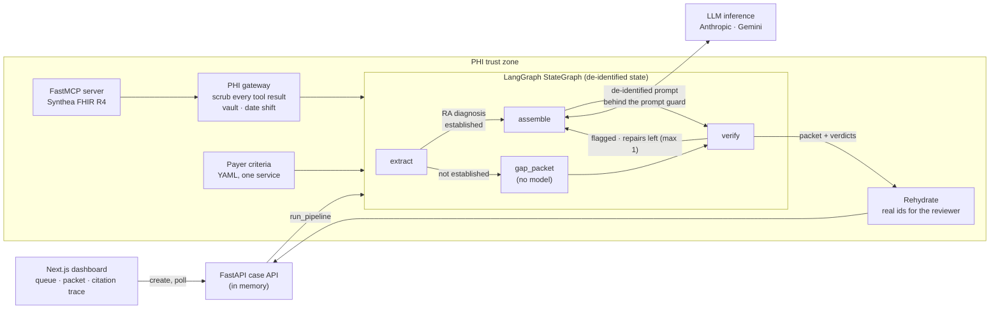

# Medical Necessity AI Engine

A clinical evaluation engine built with **LangGraph** and **LangSmith** to automate prior authorization and medical necessity checks.

The agent reads a synthetic patient chart through MCP FHIR tools, gathers the chart evidence for each of the payer's criteria, drafts the medical-necessity packet, and verifies that every assertion in that packet resolves to a real record in the chart. A reviewer dashboard shows the packet criterion by criterion, with verify's verdict and the chart record behind every citation.

**Project status: complete as a demo; no further development is planned.** See [Status](#status) for what is built and what was left out.

New to the domain or the acronyms? See the [Glossary](GLOSSARY.md).

## Architecture Overview


## Key Features
- **Stateful Routing:** the graph is a LangGraph `StateGraph` with typed state and two conditional edges. After `extract`, a case whose RA diagnosis is not established (absent, or resolved rather than active) skips the model: code writes the packet, so the case costs no tokens. After `verify`, a model-drafted packet with flagged or unaddressed criteria goes back to `assemble` once with verify's reasons (the repair loop); the first draft is kept, and evals score it alongside the final packet. The route taken and any repair are recorded in the state, in the run's events and in LangSmith.
- **Observability & Evals:** With a LangSmith key set, every run is traced, and the evals score each model as an experiment: citation resolution against ground truth, decision accuracy, tokens and estimated cost. Per-node timings are captured, and `evals/run.py` prints them, but experiment summaries do not report latency yet.
- **Deterministic Guardrails:** they fail closed. A model reply (the draft, or a repair) that does not match the schema is retried once, with the scrubbed validation error fed back (`schema_retries` in the run's usage and eval summaries); a second invalid reply stops the run, and a refusal or a PHI-guard hit is never retried. A tool error in `extract` stops the run. In `verify`, a citation that cannot be fetched counts as not found and its assertion is flagged. Besides that retry, the one fallback is the provider's: on Claude Opus 5 and Fable, a refusal is re-run server-side on another model.

**Why prior auth.** It's the highest-friction administrative workflow in US healthcare, it has an unambiguous ROI story (denial rate, A/R days), CMS electronic PA requirements tighten through 2027, and it structurally requires a human approver — which makes it the right shape for demonstrating human-in-the-loop clinical AI.

**Data.** All patient data is Synthea-generated synthetic FHIR R4 (a fixed-seed cohort of adults with rheumatoid arthritis). No PHI touches this repo, which means no BAA, and no de-identification review.

## Tech Stack
- LangGraph / LangChain
- LangSmith
- Python / Asyncio / FastAPI
- MCP (FastMCP) for chart access
- Next.js for the reviewer dashboard
- Presidio for pattern-based de-identification

## Status

Built:
- MCP server with read-only FHIR tools over the Synthea bundles (`api/app/mcp/`)
- The PHI boundary: gateway, vault, date shifting, rehydration and the outbound prompt guard (`api/app/phi/`, `api/app/llm/guard.py`)
- The graph, `extract → assemble | gap_packet → verify`, with a capped repair loop from `verify` back to `assemble`, and `run_pipeline`, the one runner for a case (`api/app/graph/`)
- Anthropic and Gemini clients on LangChain chat models (`api/app/llm/langchain_client.py`)
- Metadata-only LangSmith tracing (`api/app/observability.py`)
- Evals: one-patient runs, LangSmith experiments, the citation resolution metric and recorded results (`evals/`)
- CI on every PR and push to main: the API and eval-harness tests against scripted models, with no keys and no cohort (cohort tests skip), and the dashboard build (`.github/workflows/evals.yml`)

- Case API: list patients, create a case, run it in the background, fetch it with its node events, the rehydrated packet, verify's verdicts and each cited record (`api/app/routes/cases.py`). Cases are kept in memory.
- Reviewer dashboard: a case queue with a new-case form, and a case page with the node timeline, the packet, verify's flags and the citation trace (`web/`)

Not built (the project stopped here):
- Approve · edit · reject, and an audit trail of reviewer decisions
- Persistent cases (a database) and a live SSE stream; the dashboard polls instead
- An eval gate on PRs: CI runs the test suite against scripted models (see below), but no live-model eval with score thresholds
- Latency and run-to-run variance in experiment summaries
- Negation handling in the active-disease check: "denies joint pain" still counts as evidence (see [Evaluation](#evaluation))

### The PHI boundary

Every tool result from the chart is de-identified in the PHI gateway (`phi/gateway.py`) before the graph sees it, and the placeholder mapping is kept in an in-memory vault made for one run. Structured fields are handled field by field, and a field with no rule raises rather than passing through. Free text goes through Presidio, but without NER: names are matched against a deny-list learned from the patient's structured records, and Presidio's pattern recognizers catch phone numbers, email addresses and SSNs. NER is off on purpose: on the cohort's notes, spaCy missed the patient's first name in 100 of 100 notes and flagged clinical text as names and places. Dates are shifted by a per-patient offset, not redacted, so durations still compute. Before any prompt leaves, a guard (`llm/guard.py`) refuses it if it holds a value the vault knows to be real.

The model responds referencing placeholders; `run_pipeline` rehydrates the packet and the verdicts in its return value, the copy meant for the reviewer. The vault is never written to disk and is cleared when the run ends.

This is the design decision worth arguing about, and the six questions it exists to answer:

| Question                           | Answer in this system                                                    |
| ---------------------------------- | ------------------------------------------------------------------------ |
| Where does inference run?          | Third-party API, which is exactly why the scrub layer exists             |
| Is anything retained for training? | The payload is de-identified regardless. Zero data retention is a setting on the provider account; nothing in this code configures it |
| How is context minimized?          | `extract` scopes retrieval to the criteria; the full chart is never sent |
| What's logged, and where?          | Metadata-only spans; prompt capture is opt-in; the re-ID map never logged |
| How is output attributed?          | An evidence assertion cites records by `resource_type` and id: a Condition, MedicationRequest, Observation or DocumentReference. `verify` flags one with no citations. The dashboard shows each citation with the record it resolves to |
| What's the audit trail?            | Not built: the dashboard shows the packet and its verdicts, but reviewer decisions are not recorded |

### The graph

Four nodes, two paths and one loop. They are plain async functions wired into a LangGraph `StateGraph` in `graph/build.py`:

```
extract ─┬─ ra_diagnosis established ──▶ assemble ───┬─▶ verify ──▶ done
         │                                  ▲        │      │
         │                                  └────────┼──────┘  flagged or unaddressed criteria,
         └─ not established ───────────▶ gap_packet ─┘          model-drafted, repairs left (max 1)
```

The routing decision is the conditional edge after `extract`, made by `route_after_extract` with the same `established` rule `verify` and the eval ground truth use. Without an active diagnosis no packet can be approved, so there is nothing for a model to weigh. `run_pipeline` in the same module is the one way a case is run, by the evals and the API alike: it makes the per-run vault, PHI gateway and prompt guard, and reports progress as events that carry metadata only. The events follow whichever node actually ran.

The repair loop is the conditional edge after `verify` (`route_after_verify`). The repair call sees only the flagged and unaddressed criteria: their evidence, what the model wrote, and verify's reasons. Its answers replace those criteria and nothing else. A criterion it leaves out keeps its old assertion, still flagged. Because verify's reasons are its verdict, verify is no longer independent for a repaired criterion, so the first packet is kept (`draft_packet`, `draft_verification`) and evals report `first_pass_*` scores next to the final ones. A code-written gap packet never loops. If the repair call gives no usable answer (a refusal, or a reply that still fails validation after its retry), the first packet goes to the reviewer with its flags and `repair_failed` records why; a PHI-guard hit still fails the run.

- **`extract`** — for each criterion in the payer's criteria file, pulls the chart evidence bearing on it via MCP FHIR tools: records filtered by code, and keyword-matching lines from the most recent notes
- **`assemble`** — drafts the packet against the payer's criteria for that service
- **`gap_packet`** — writes the packet without a model when the diagnosis is not established: a gap for each criterion the chart does not meet, and an evidence assertion citing the records for any it does
- **`verify`** — resolves each generated assertion back to a record in the chart; unsupported claims are flagged for the reviewer, never silently dropped

### Evaluation

The eval dataset runs as LangSmith experiments (`evals/experiment.py`), one per model, scored against Synthea ground truth. There is no LLM-judged faithfulness metric in the MVP: it would add a model call (and cost) to every run, and `verify` already checks what a payer would reject. Known limits: nothing checks that an assertion's *wording* is faithful to the source it cites, only that the citation exists and bears on the criterion. And the active-disease check matches keywords without negation, so a note line such as "denies joint pain" counts as evidence; the eval's ground truth shares that rule, so the evals cannot catch it.

The metric that matters here is **citation resolution rate**: of the assertions the agent makes in a packet, what fraction point at a record that exists _and_ actually supports the claim. It's domain-specific, it's the thing a payer would reject the packet over, and it's scored against Synthea ground truth rather than an LLM judge.

LangSmith collects runtime traces out-of-band: one run per graph node with counts, criterion ids, the model that answered, and token and cost figures. LangGraph and LangChain would trace every run's whole inputs and outputs on their own, so the LangSmith client used here drops everything but an allowlist of keys, and only what we write ourselves (run names, timings, metadata) is sent. Nothing that sees raw data (the MCP client or server, HTTP clients, request bodies) is traced, and a test enforces that. Recording states, prompts and responses in full (de-identified) is opt-in (`LANGSMITH_CAPTURE_CONTENT`), because LangSmith retains what it stores. Don't set `LANGSMITH_TRACING`: the app turns tracing on itself, through that client.

---

## Repo structure

```
medical-necessity/
├── README.md
├── docker-compose.yml
├── .env.example
│
├── api/                           # FastAPI application
│   ├── pyproject.toml
│   ├── app/
│   │   ├── main.py
│   │   ├── config.py
│   │   ├── observability.py       # LangSmith client with a metadata-only allowlist
│   │   ├── routes/
│   │   │   └── cases.py           # patients; create, run and fetch a case (in memory)
│   │   ├── graph/
│   │   │   ├── build.py           # LangGraph StateGraph wiring, the route, run_pipeline
│   │   │   ├── state.py           # typed graph state
│   │   │   ├── criteria.py        # loads the payer criteria YAML
│   │   │   ├── support.py         # whether a record bears on a criterion
│   │   │   └── nodes/
│   │   │       ├── extract.py
│   │   │       ├── assemble.py
│   │   │       ├── gap_packet.py  # the no-model path when the diagnosis is not established
│   │   │       └── verify.py
│   │   ├── phi/
│   │   │   ├── gateway.py         # the only path to the chart; scrubs every tool result
│   │   │   ├── anonymize.py       # field rules, deny-list names, Presidio patterns
│   │   │   ├── dates.py           # per-patient date shifting
│   │   │   ├── vault.py           # per-run re-ID map, TTL
│   │   │   └── rehydrate.py
│   │   ├── llm/
│   │   │   ├── client.py          # provider-agnostic interface + factory
│   │   │   ├── langchain_client.py  # Anthropic and Gemini via LangChain chat models
│   │   │   ├── guard.py           # refuses any prompt holding a value the vault knows
│   │   │   └── prompts/
│   │   ├── mcp/
│   │   │   ├── server.py          # FastMCP server (streamable HTTP, :8001)
│   │   │   ├── client.py          # opens a session; reconnects when the server restarts
│   │   │   ├── tools.py           # FHIR read tools exposed to the agent
│   │   │   ├── models.py          # typed tool results; id + resource_type = the citation
│   │   │   └── store.py           # lazy per-patient loader over the Synthea bundles
│   └── tests/
│
├── data/
│   ├── synthea/                   # generated FHIR R4 bundles (gitignored)
│   ├── generate.sh                # Synthea invocation + seed, keeps RA patients
│   └── payer_criteria/
│       └── adalimumab_ra.yaml     # one service line, hardcoded on purpose
│
├── evals/
│   ├── dataset.py                 # cases + ground truth from Synthea
│   ├── run.py                     # one patient, end to end, scored
│   ├── experiment.py              # the dataset as LangSmith experiments, one per model
│   ├── metrics/
│   │   └── citation_resolution.py
│   ├── test_*.py                  # harness tests against scripted models
│   └── RESULTS.md                 # scores across both providers
│
├── web/                           # Next.js reviewer dashboard
│   ├── app/
│   │   ├── page.tsx               # case queue and new-case form
│   │   └── cases/[id]/page.tsx    # timeline, summary, packet
│   ├── components/
│   │   ├── PacketView.tsx         # criterion by criterion, with verify's verdict
│   │   └── CitationTrace.tsx      # assertion → source record
│   └── lib/api.ts
│
└── .github/workflows/
    └── evals.yml                  # CI: API and harness tests (scripted models) and the web build
```

---

## Running it

```bash
cp .env.example .env               # set LLM_PROVIDER (anthropic | gemini) and its key
./data/generate.sh                 # Synthea → FHIR R4 bundles (needs Docker; ~30 min for 30 patients)
docker compose up
```

Dashboard on `:3000`, API on `:8000`, MCP server on `:8001`.

### The demo, in two minutes

1. Open <http://localhost:3000>, pick a patient and press **Start case**. Loyd638 is a good first one: an active RA diagnosis, notes showing active disease, and a completed methotrexate order whose duration the chart cannot establish, so that criterion is a gap.
2. The case page follows the nodes as they run (`extract → assemble → verify`), then shows the packet: each criterion as evidence or a gap, verify's verdict, and for every citation the chart record it resolves to (open a note to read it).
3. Pick Denis399, whose RA diagnosis is not active: the timeline goes `extract → gap_packet → verify`, and the summary says no model was called.
4. A flagged assertion, when a model overclaims, is shown in red with verify's reasons; if the repair loop ran, the summary names the criteria that went back to the model.

Cases live in the API's memory, so restarting it clears the queue. The API needs a provider key in `.env`; without one it still serves, and a case fails with the reason.

The evals run on the host, from the repo root, with the API package installed:

```bash
pip install -e 'api[dev]'
python evals/experiment.py                       # the eval: the dataset on both configured models, as LangSmith experiments
python evals/run.py --patient Loyd638 --provider both   # one patient, end to end
cd evals && pytest                               # harness tests against scripted models; no model calls
```

`experiment.py` and `run.py` call real models, so they need the provider keys in `.env`. Without a `LANGSMITH_API_KEY` they still run and score locally; nothing is uploaded.

---

## Deliberately out of scope

Named so the omissions read as decisions rather than gaps:

- **No auth, no multi-tenancy.** Single-reviewer demo.
- **No real payer integration.** No X12 278 generation, no clearinghouse. One payer's criteria, in YAML.
- **No real EHR.** Synthea only. A real deployment substitutes a SMART on FHIR backend service client behind the same MCP interface — which is the point of putting MCP there.
- **No write-back.** The packet leaves as a document, not an order.
